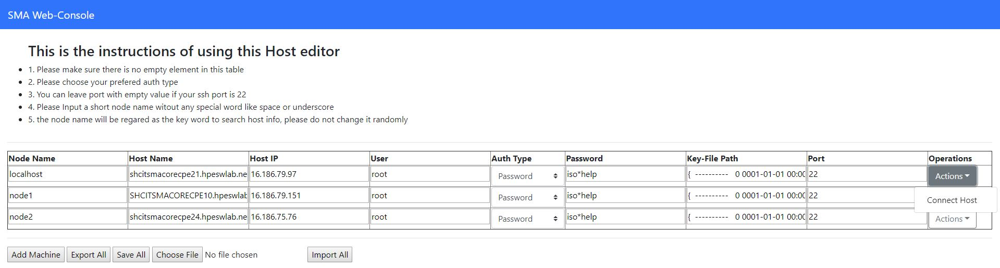
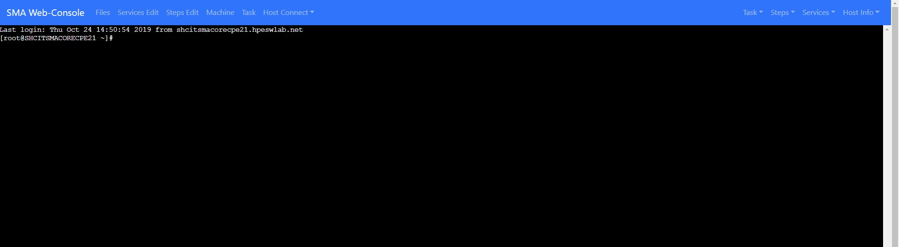
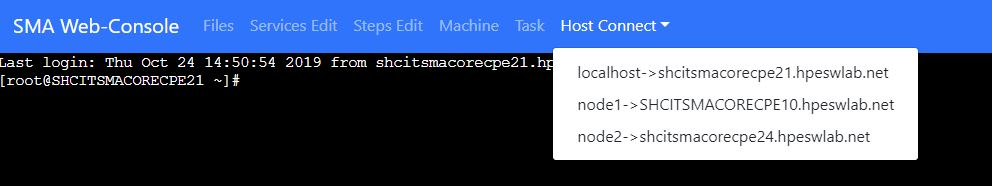
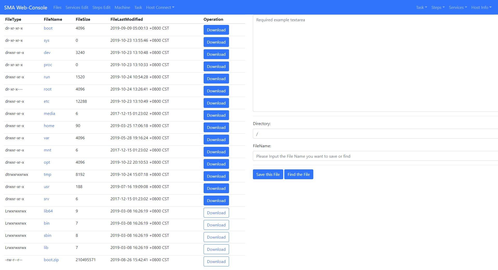
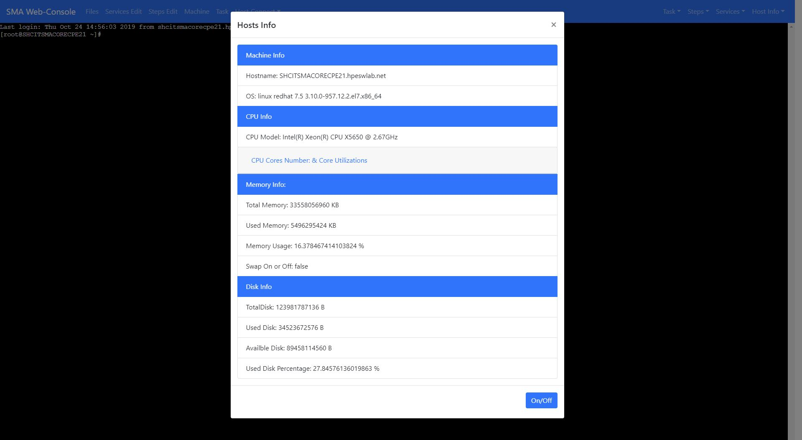
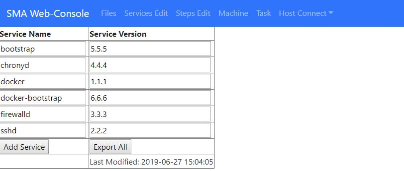
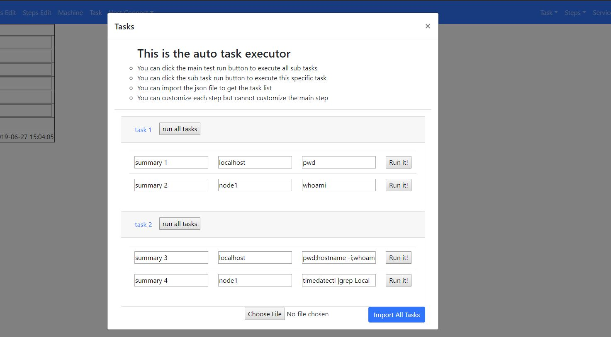
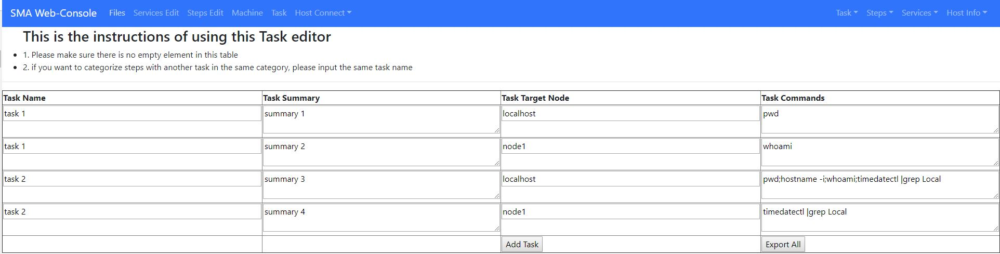
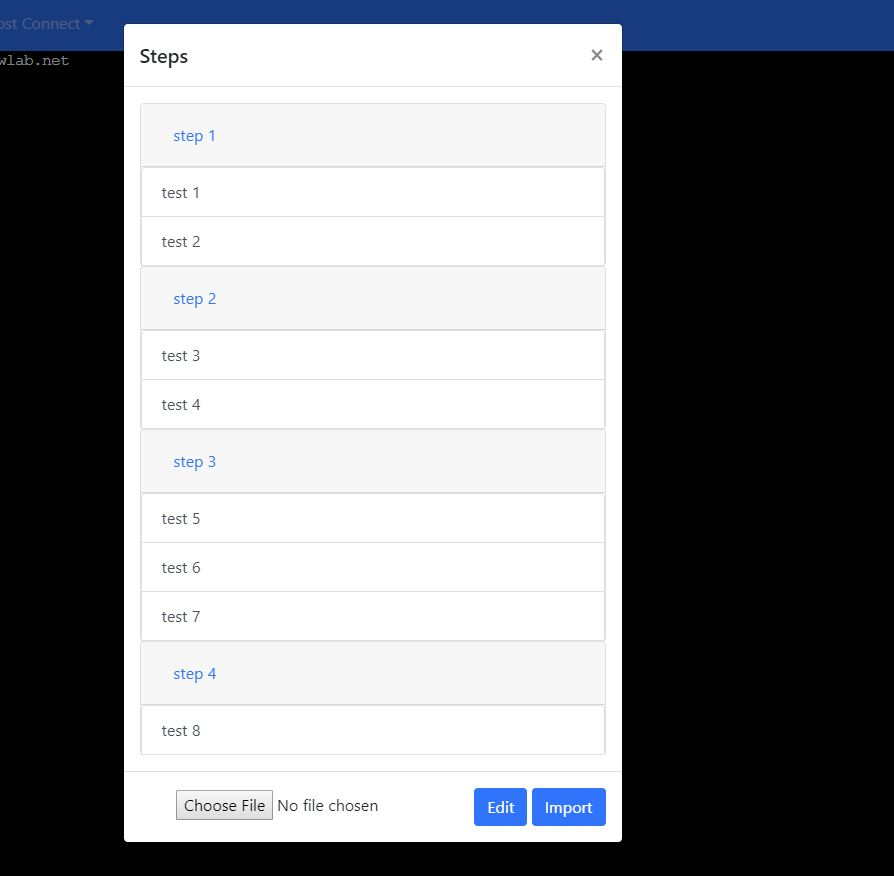

# Beego_Webconsole ##
### Application Features ###
> 1. Multi-Linux Machine Web Shell UI Page;
> 2. Multi-Linux Machine File System Access & File Operations Handling;
> 3. The Linux Machine Performance & Assigned Services real-time Monitoring;
> 4. Multi-Linux Machine Task Group One-Click Executions;
> 5. Internal Documents in UI Page;
### Feature Presentations ###
**1. Multi-Linux Machine Web Shell UI Page;**
> This web application allows user to add Linux machines, and provides an
Internal web shell windows to run Linux Command as usual.
* In below page user can customize your Linux machine and click the button to
have a quick redirection for any machine saved.

* After SSH to the Linux machine, you can have the main web page to run normal
Linux commands like below Page.

* The "Host Connect" short cuts allows user to quickly switch different machine
like below page

**2. Multi-Linux Machine File System Access & File Operations Handling;**
> This web application also offers the user a file server for your logged
Linux machine and do the basic file Operations such as open & download
* when you click the file button, you can access the file system for this Linux
machine and do the basic operations.

* you can do the below basic file operations for every file or folder:
> 1. Open the file and check its content
> 2. Edit the file and save its content
> 3. Click the download button to down the whole folder or single file
> 4. Check the file's type and its basic information

**3. The Linux Machine Performance & Assigned Services real-time Monitoring;**
> This web application use web-socket protocol to have a real-time performance
and appointed services check.
* In the main page, user can click "Host Info" button to check the performance
include CPU, Disk & Memory Usage for your current machine.

* And in the same page, user can click "Services" button to check the assigned services, and these services can be assigned by import designed json file.
Currently the function has been designed, but the UI presentations has not been designed.

* the json file can be edited and exported in the below service page.

**4. Multi-Linux Machine Task Group One-Click Executions;**
> This web application allows user to customize a set of command group, and user can do the assigned commands for each node by only one-click.
* In the main page, you can click the "task" button to call the task executions
console, and run every task group by one-click like below page.

* And you can also use the task editor to generate different task json file, and then you can use these json file to have different task job.

**5. Embeded Documents in UI Page;**
> This web application allows user to have a online document, user can have a better experience when they try to install packages or do some environment preparing.
* you can click the "step" button to call this document panel like below page.

### How To Deploy ###
* this is a golang coded application, so this is very easy to deploy this application in your environment without any dependencies installed.
1. download the tar file using below command:

> `go get github.com/Godcrying123/Beego_Webconsole.git`

2. untar this tar package by command:

> `mkdir -p webconsole && mv webconsole_sma.tar.gz webconsole && cd webconsole`\
> `tar -xvf webconsole_sma.tar.gz`

3. go to the conf file and edit the app.conf file based on the given hints

> appname = webconsole_sma\
> runmode = dev\
> httpport = 8099 (customize the application listen port)\
> sshHost = "shcitsmacorecpe21.hpeswlab.net" (customize the localhost hostname)\
> sshHostIP = "16.186.79.97" (customize the localhost IP Address)\
> sshUser = "root" (customize the user name for accessing this machine)\
> sshPassword = "iso*help" (customize the user password for this user)\
> sshPort = 22\
> sshType = "password"
* you can leave other fields with default value if you do not customize these for your Linux Machine.

4. then you can run the below command to startup this application.
* as I am developing this application in Linux platform, so the basic functions in the windows platform might be stable. you better run this application in MacOS & Linux for the test.

> `chmod u+x webconsole_sma && ./webconsole_sma`

### Thanks ###
Thanks for using this tool, this tool is still in an alpha version, and there are still a lot bugs and limitations. If you have any interests for this tool, please feel free to contact me.
